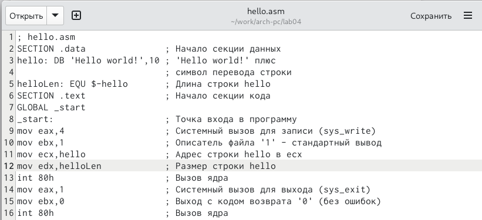
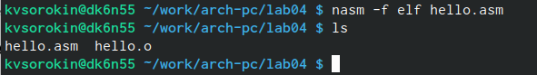
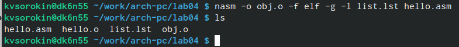
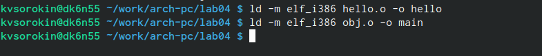
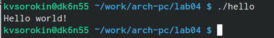
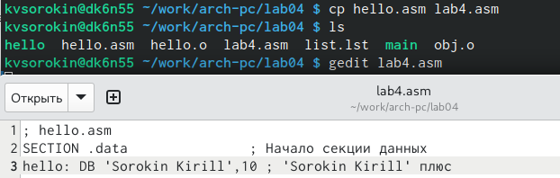
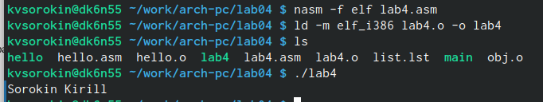
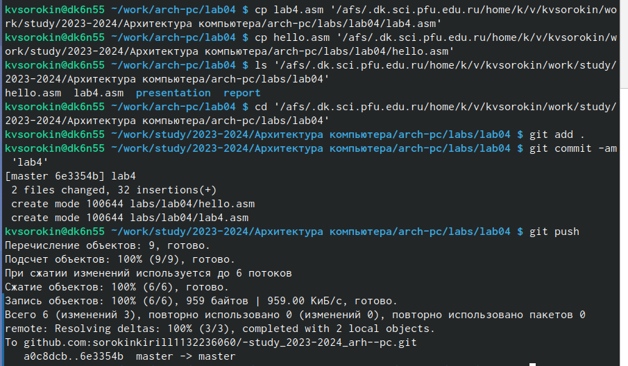

---
## Front matter
title: "Лабораторная работа номер 4."
subtitle: "Создание и процесс обработки программ на языке ассемблера NASM"
author: "Сорокин Кирилл"

## Generic otions
lang: ru-RU
toc-title: "Содержание"

## Bibliography
bibliography: bib/cite.bib
csl: pandoc/csl/gost-r-7-0-5-2008-numeric.csl

## Pdf output format
toc: true # Table of contents
toc-depth: 2
lof: true # List of figures
fontsize: 12pt
linestretch: 1.5
papersize: a4
documentclass: scrreprt
## I18n polyglossia
polyglossia-lang:
  name: russian
  options:
	- spelling=modern
	- babelshorthands=true
polyglossia-otherlangs:
  name: english
## I18n babel
babel-lang: russian
babel-otherlangs: english
## Fonts
mainfont: PT Serif
romanfont: PT Serif
sansfont: PT Sans
monofont: PT Mono
mainfontoptions: Ligatures=TeX
romanfontoptions: Ligatures=TeX
sansfontoptions: Ligatures=TeX,Scale=MatchLowercase
monofontoptions: Scale=MatchLowercase,Scale=0.9
## Biblatex
biblatex: true
biblio-style: "gost-numeric"
biblatexoptions:
  - parentracker=true
  - backend=biber
  - hyperref=auto
  - language=auto
  - autolang=other*
  - citestyle=gost-numeric
## Pandoc-crossref LaTeX customization
figureTitle: "Рис."
tableTitle: "Таблица"
listingTitle: "Листинг"
lofTitle: "Список иллюстраций"
lolTitle: "Листинги"
## Misc options
indent: true
header-includes:
  - \usepackage{indentfirst}
  - \usepackage{float} # keep figures where there are in the text
  - \floatplacement{figure}{H} # keep figures where there are in the text
---

# Цель работы

Научиться компилировать и собирать программы, написанные на ассемблере NASM.

# Задание

Изучить теоретический материал, и на его основе написать простейшие программы на языке ассемблер NASM.

# Теоретическое введение

Язык ассемблера (assembly language, сокращённо asm) — машинно-ориентированный язык низкого уровня. NASM — это открытый проект ассемблера, версии которого доступны под различные операционные системы и который позволяет получать объектные файлы для этих систем. В NASM используется Intel-синтаксис и поддерживаются инструкции x86-64. 

# Выполнение лабораторной работы

Создадим папку для выполнения работы и перейдём в неё (рис. @fig:001).

{#fig:001 width=70%}

Командой touch создадим файл hello.asm, где будем писать текст программы (рис. @fig:002).

{#fig:002 width=70%}

Заполним содержимое файла представленным нам текстом программы (рис. @fig:003).

{#fig:003 width=70%}

Командой nasm создадим объектный файл hello.o (рис. @fig:004).

{#fig:004 width=70%}

С помощью парамерта -o создадим объектный файл с заданным именем (obj), при этом формат выходного файла будет elf, и в него будут включены символы для отладки благодаря параметру -g и будет создан файл листинга (list.lst) благодаря параметру -l. (рис. @fig:005).

{#fig:005 width=70%}

Командой ld создадим из объектных файлов исполняемые файлы (рис. @fig:006).

{#fig:006 width=70%}

Запустим исполняемый файл (рис. @fig:007).

{#fig:007 width=70%}

В качестве самостоятельной работы скопируем файл hello.asm с именем lab4.asm, а затем отредактируем его как указанно в задание (рис. @fig:008).

{#fig:008 width=70%}

Создадим объектный файл и исполняемый файл из lab4.asm, после чего запустим его (рис. @fig:009).

{#fig:009 width=70%}

Скопируем файлы lab4.asm и hello.asm в рабочую папку лабораторной работы, после чего выгрузим их на Github (рис. @fig:010).

{#fig:010 width=70%}

# Выводы

Мы освоили процедуру компиляции и сборки программ, написанных на ассемблере NASM.

# Список литературы{.unnumbered}

1. GDB: The GNU Project Debugger. — URL: https://www.gnu.org/software/gdb/.
2. GNU Bash Manual. — 2016. — URL: https://www.gnu.org/software/bash/manual/.
3. Midnight Commander Development Center. — 2021. — URL: https://midnight-commander.org/.
4. NASM Assembly Language Tutorials. — 2021. — URL: https://asmtutor.com/.
5. Newham C. Learning the bash Shell: Unix Shell Programming. — O’Reilly Media, 2005. — 354 с. — (In a Nutshell). — ISBN 0596009658. — URL: http://www.amazon.com/Learning-bash-Shell-Programming-Nutshell/dp/0596009658.
6. Robbins A. Bash Pocket Reference. — O’Reilly Media, 2016. — 156 с. — ISBN 978-1491941591.
7. The NASM documentation. — 2021. — URL: https://www.nasm.us/docs.php.
8. Zarrelli G. Mastering Bash. — Packt Publishing, 2017. — 502 с. — ISBN 9781784396879.
9. Колдаев В. Д., Лупин С. А. Архитектура ЭВМ. — М. : Форум, 2018.
10. Куляс О. Л., Никитин К. А. Курс программирования на ASSEMBLER. — М. : Солон-Пресс, 2017.
11. Новожилов О. П. Архитектура ЭВМ и систем. — М. : Юрайт, 2016.
12. Расширенный ассемблер: NASM. — 2021. — URL: https://www.opennet.ru/docs/RUS/nasm/.
13. Робачевский А., Немнюгин С., Стесик О. Операционная система UNIX. — 2-е изд. — БХВ Петербург, 2010. — 656 с. — ISBN 978-5-94157-538-1.
14. Столяров А. Программирование на языке ассемблера NASM для ОС Unix. — 2-е изд. — М. : МАКС Пресс, 2011. — URL: http://www.stolyarov.info/books/asm_unix.
15. Таненбаум Э. Архитектура компьютера. — 6-е изд. — СПб. : Питер, 2013. — 874 с. — (Классика Computer Science).
16. Таненбаум Э., Бос Х. Современные операционные системы. — 4-е изд. — СПб. : Питер,
2015. — 1120 с. — (Классика Computer Science).
