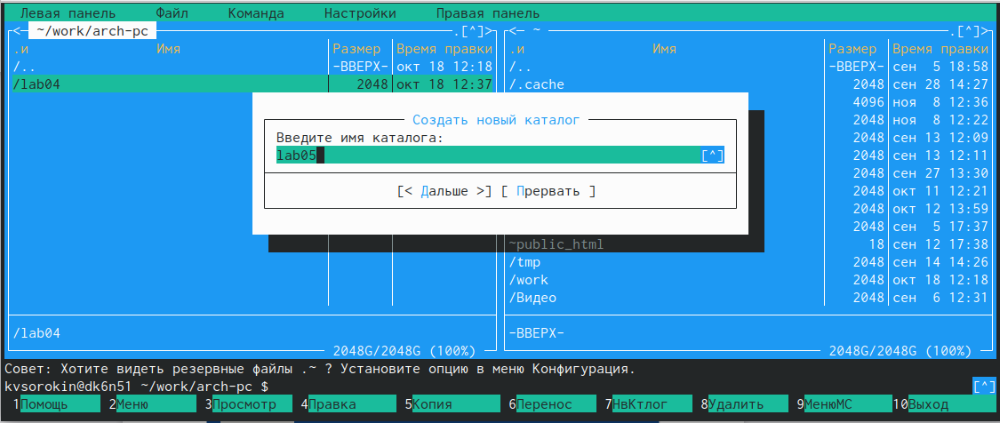

---
## Front matter
title: "Лабораторная работа номер 5."
subtitle: "Основы работы с Midnight Commander (mc). Структура программы на языке ассемблера NASM. Системные вызовы в ОС GNU Linux"
author: "Сорокин Кирилл"

## Generic otions
lang: ru-RU
toc-title: "Содержание"

## Bibliography
bibliography: bib/cite.bib
csl: pandoc/csl/gost-r-7-0-5-2008-numeric.csl

## Pdf output format
toc: true # Table of contents
toc-depth: 2
lof: true # List of figures
fontsize: 12pt
linestretch: 1.5
papersize: a4
documentclass: scrreprt
## I18n polyglossia
polyglossia-lang:
  name: russian
  options:
	- spelling=modern
	- babelshorthands=true
polyglossia-otherlangs:
  name: english
## I18n babel
babel-lang: russian
babel-otherlangs: english
## Fonts
mainfont: PT Serif
romanfont: PT Serif
sansfont: PT Sans
monofont: PT Mono
mainfontoptions: Ligatures=TeX
romanfontoptions: Ligatures=TeX
sansfontoptions: Ligatures=TeX,Scale=MatchLowercase
monofontoptions: Scale=MatchLowercase,Scale=0.9
## Biblatex
biblatex: true
biblio-style: "gost-numeric"
biblatexoptions:
  - parentracker=true
  - backend=biber
  - hyperref=auto
  - language=auto
  - autolang=other*
  - citestyle=gost-numeric
## Pandoc-crossref LaTeX customization
figureTitle: "Рис."
listingTitle: "Листинг"
lofTitle: "Список иллюстраций"
lotTitle: "Список таблиц"
lolTitle: "Листинги"
## Misc options
indent: true
header-includes:
  - \usepackage{indentfirst}
  - \usepackage{float} # keep figures where there are in the text
  - \floatplacement{figure}{H} # keep figures where there are in the text
---

# Цель работы

Начиться работать с Midnight Commander, а также освоить инструкции mov и int в языке ассемблера.

# Задание

Используя MC, написать программы, основываясь на приведённых материалах, а затем выполнить самостоятельную работу.

# Теоретическое введение

Midnight Commander (или просто mc) — это программа, которая позволяет просматривать структуру каталогов и выполнять основные операции по управлению файловой системой, т.е. mc является файловым менеджером. Midnight Commander позволяет сделать работу с файлами более удобной и наглядной.
Инструкция языка ассемблера mov предназначена для дублирования данных источника в приёмнике. Инструкция языка ассемблера int предназначена для вызова прерывания с указанным
номером.

# Выполнение лабораторной работы

Откроем Midnight Commander командой mc (рис. @fig:001).

{#fig:001 width=70%}

Перейдём в необходимую нам дерикторию(рис. @fig:002).

{#fig:002 width=70%}

С помощью клавиши F7 создадим папку(рис. @fig:003).

{#fig:003 width=70%}

Удостоверимся, что папка создана (рис. @fig:004).

{#fig:004 width=70%}

Командой touch создадим файл lab5-1.asm (рис. @fig:005).

{#fig:005 width=70%}

Откроем файл для редактирование клавишой F4 (рис. @fig:006).

{#fig:006 width=70%}

Введём текст программы в файл (рис. @fig:007).

{#fig:007 width=70%}

Так как у нас редактор mcedit нажмем клавишу F2 для сохранения и клавишой F10 для выхода из редактирования файла (рис. @fig:008).

{#fig:008 width=70%}

Нажмём клавишу F3 для просмотра содежимого файла lab5-1.asm (рис. @fig:009).

{#fig:009 width=70%}

Оттрансилруем текст lab5-1.asm в объектный файл, затем выполним его компоновку и запустим файл командой ./lab5-1 (рис. @fig:010).

{#fig:010 width=70%}

Убедимся в правильности работы программы (рис. @fig:011).

{#fig:011 width=70%}

Для удобства откроем дополнительную панель терминала и найдём заранее скаченный файл in_out.asm (рис. @fig:012).

{#fig:012 width=70%}

Скопируем файл в наш рабочий каталог с помощью клавиши F5 (рис. @fig:014).

{#fig:014 width=70%}

Убедимся, что он корректно перенёсся (рис. @fig:015).

{#fig:015 width=70%}

Создадим копию файла lab5-1.asm с именем lab5-2.asm (рис. @fig:016).

{#fig:016 width=70%}

Отредактируем его, так чтобы он использовал файл in_out.asm (рис. @fig:017).

{#fig:017 width=70%}

Создадим его объектный файл и файл программы (рис. @fig:019).

{#fig:019 width=70%}

Проверим его работу (рис. @fig:020).

{#fig:020 width=70%}

Заменим подпрограмму sprintLF на sprint (рис. @fig:021).

{#fig:021 width=70%}

Выполним новую программу и заметим, что теперь ввод текста идёт не с новой строки, а стой же на какой был напичатан изначальный текст (рис. @fig:022).

{#fig:022 width=70%}

## Самостоятельная работа

Создадим копию файла lab5-1.asm с именем lab5-1s.asm для самостоятельной работы (рис. @fig:023).

{#fig:023 width=70%}

Для того чтобы новая программа выполняла дополнительные действия добавим вывод, ранее введённых данных, и запросим новый ввод, чтобы была возможность отследить результат вывода (рис. @fig:024).

{#fig:024 width=70%}

Создадим все файлы для работы программы (рис. @fig:025).

{#fig:025 width=70%}

Запустим программу и убедимся, что она корректно выполняет заданное задание (рис. @fig:026).

{#fig:026 width=70%}

Создадим копию файла lab5-2.asm с именем lab5-2s.asm для самостоятельной работы (рис. @fig:027).

{#fig:027 width=70%}

От редактируем новую программу. Чтобы она могла выполнить все необходимые действия добавим вывод, ранее введённых данных, и запросим новый ввод, чтобы была возможность отследить результат вывода (рис. @fig:028).

{#fig:028 width=70%}

Создадим все файлы для работы программы (рис. @fig:029).

{#fig:029 width=70%}

Запустим программу и убедимся, что она корректно выполняет заданное задание, но из-за того, что в изначальном файле lab5-2.asm мы оставили sprint, а не sprintLF, то вид ввода немного отличается от lab5-1s (рис. @fig:030).

{#fig:030 width=70%}

# Выводы

Мы научились использовать Midnight Commander, а также написали несколько программ на языке ассемблера с использованием новых инструкций.

# Список литературы{.unnumbered}

1. GDB: The GNU Project Debugger. — URL: https://www.gnu.org/software/gdb/.
2. GNU Bash Manual. — 2016. — URL: https://www.gnu.org/software/bash/manual/.
3. Midnight Commander Development Center. — 2021. — URL: https://midnightcommander.org/.
4. NASM Assembly Language Tutorials. — 2021. — URL: https://asmtutor.com/.
5. Newham C. Learning the bash Shell: Unix Shell Programming. — O’Reilly Media, 2005. — 354 с. — (In a Nutshell). — ISBN 0596009658. — URL: http://www.amazon.com Learning-bash-Shell-Programming-Nutshell/dp/0596009658.
6. Robbins A. Bash Pocket Reference. — O’Reilly Media, 2016. — 156 с. — ISBN 978-1491941591.
7. The NASM documentation. — 2021. — URL: https://www.nasm.us/docs.php.
8. Zarrelli G. Mastering Bash. — Packt Publishing, 2017. — 502 с. — ISBN 9781784396879.
9. Колдаев В. Д., Лупин С. А. Архитектура ЭВМ. — М. : Форум, 2018.
10. Куляс О. Л., Никитин К. А. Курс программирования на ASSEMBLER. — М. :Солон-Пресс, 2017.
11. Новожилов О. П. Архитектура ЭВМ и систем. — М. : Юрайт, 2016.
12. Расширенный ассемблер: NASM. — 2021. — URL: https://www.opennet.ru/docs/RUS/nasm/.
13. Робачевский А., Немнюгин С., Стесик О. Операционная система UNIX. — 2-е изд. — БХВ- Петербург, 2010. — 656 с. — ISBN 978-5-94157-538-1.
14. Столяров А. Программирование на языке ассемблера NASM для ОС Unix. — 2-е изд. — М. : МАКС Пресс, 2011. — URL: http://www.stolyarov.info/books/asm_unix.
15. Таненбаум Э. Архитектура компьютера. — 6-е изд. — СПб. : Питер, 2013. - 874 с. — (Классика Computer Science).
16. Таненбаум Э., Бос Х. Современные операционные системы. — 4-е изд. -СПб. : Питер,
2015. — 1120 с. — (Классика Computer Science)
