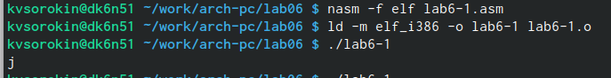

---
## Front matter
title: "Лабораторная работа номер 6."
subtitle: " Арифметические операции в NASM"
author: "Сорокин Кирилл"

## Generic otions
lang: ru-RU
toc-title: "Содержание"

## Bibliography
bibliography: bib/cite.bib
csl: pandoc/csl/gost-r-7-0-5-2008-numeric.csl

## Pdf output format
toc: true # Table of contents
toc-depth: 2
lof: true # List of figures
fontsize: 12pt
linestretch: 1.5
papersize: a4
documentclass: scrreprt
## I18n polyglossia
polyglossia-lang:
  name: russian
  options:
	- spelling=modern
	- babelshorthands=true
polyglossia-otherlangs:
  name: english
## I18n babel
babel-lang: russian
babel-otherlangs: english
## Fonts
mainfont: PT Serif
romanfont: PT Serif
sansfont: PT Sans
monofont: PT Mono
mainfontoptions: Ligatures=TeX
romanfontoptions: Ligatures=TeX
sansfontoptions: Ligatures=TeX,Scale=MatchLowercase
monofontoptions: Scale=MatchLowercase,Scale=0.9
## Biblatex
biblatex: true
biblio-style: "gost-numeric"
biblatexoptions:
  - parentracker=true
  - backend=biber
  - hyperref=auto
  - language=auto
  - autolang=other*
  - citestyle=gost-numeric
## Pandoc-crossref LaTeX customization
figureTitle: "Рис."
listingTitle: "Листинг"
lofTitle: "Список иллюстраций"
lotTitle: "Список таблиц"
lolTitle: "Листинги"
## Misc options
indent: true
header-includes:
  - \usepackage{indentfirst}
  - \usepackage{float} # keep figures where there are in the text
  - \floatplacement{figure}{H} # keep figures where there are in the text
---

# Цель работы

Научиться писать арифметические инструкции языка ассемблер

# Задание

Изучить приведённый материал на практике и выполнить самостоятельную работу.

# Теоретическое введение

Схема команды целочисленного сложения add (от англ. addition - добавление) выполняет сложение двух операндов и записывает результат по адресу первого операнда. Команда целочисленного вычитания sub (от англ. subtraction – вычитание) работает аналогично команде add.Довольно часто при написании программ встречается операция прибавления или вычитания единицы. Прибавление единицы называется инкрементом, а вычитание  декрементом. Для этих операций существуют специальные команды: inc (от англ. increment) и dec (от англ.decrement), которые увеличивают и уменьшают на 1 свой операнд.

# Выполнение лабораторной работы

Создадим необходимые для работы директории и файлы (рис. @fig:001).

{#fig:001 width=70%}

Откроем файл lab6-1.asm и введём в него текст программы(рис. @fig:002).

{#fig:002 width=70%}

После компиляции файлов запустим программу и увидим, нежелаемый результат - j, вместо 10(рис. @fig:003).

{#fig:003 width=70%}

Уберём ковычки у числе в тексте программы(рис. @fig:004).

{#fig:004 width=70%}

Попробуем ещё раз выполнить программу и увидим, что вывелся символ с кодом 10, а не 10(рис. @fig:005).

{#fig:005 width=70%}

Создадим файл lab6-2.asm и введём в него более корректный код(рис. @fig:006).

{#fig:006 width=70%}

После выполнения опять увидим, что вместо числа 10, пишется число 106(рис. @fig:007).

{#fig:007 width=70%}

Уберём ковычки у числе в тексте программы (рис. @fig:008).

{#fig:008 width=70%}

Наконец после выполнения увидим желаемый ответ (рис. @fig:009).

{#fig:009 width=70%}

Создадим файл lab6-3.asm и запишем в него программу, выполняющую (5 * 2 + 3)/3 (рис. @fig:010).

{#fig:010 width=70%}

Выполним программу и убедимся в верности полученного результата (рис. @fig:011).

{#fig:011 width=70%}

Заменим значения в программе, чтобы она считала (4*6 + 2)/5 (рис. @fig:012).

{#fig:012 width=70%}

Выполним у убедимся в верности выполнения (рис. @fig:013).

{#fig:013 width=70%}

Создадим файл variant.asm и скопируем туда текст программы называющей вариант задания (рис. @fig:014).

{#fig:014 width=70%}\

Выполним, и узнаем, что по нашему билету получаем первый вариант (рис. @fig:015).

{#fig:015 width=70%}

## Ответы на вопросы:

1. 'mov eax, msg' и 'call sprintLF'
2. Для считывания и записывания в информации в Х с максимальной длинной 80
3. Для перевода введённых данных в число 
4. Строки 'xor edx, edx', 'mov ebx,20', 'div ebx', 'inc edx'
5. В edx
6. Для увеличения на значения на 1
7. 'mov eax, edx' и 'call iprintLF'

## Самостоятельная работа

Создадим файл sam.asm для самостоятельной работы и напишем в нём программу согласно тому, что у нам первый вариант (рис. @fig:016).

{#fig:016 width=70%}

Основываясь на полученных занниях напишем программу для вычисления выражения (10+2х)/3 (рис. @fig:017).

{#fig:017 width=70%}

Запустим программу и убедимся, что оба введённые значения выдают верный результат (рис. @fig:019).

{#fig:019 width=70%}

# Выводы

Мы научились использовать писать простые программы для вычисления на языке ассемблера

# Список литературы{.unnumbered}

1. GDB: The GNU Project Debugger. — URL: https://www.gnu.org/software/gdb/.
2. GNU Bash Manual. — 2016. — URL: https://www.gnu.org/software/bash/manual/.
3. Midnight Commander Development Center. — 2021. — URL: https://midnightcommander.org/.
4. NASM Assembly Language Tutorials. — 2021. — URL: https://asmtutor.com/.
5. Newham C. Learning the bash Shell: Unix Shell Programming. — O’Reilly Media, 2005. — 354 с. — (In a Nutshell). — ISBN 0596009658. — URL: http://www.amazon.com Learning-bash-Shell-Programming-Nutshell/dp/0596009658.
6. Robbins A. Bash Pocket Reference. — O’Reilly Media, 2016. — 156 с. — ISBN 978-1491941591.
7. The NASM documentation. — 2021. — URL: https://www.nasm.us/docs.php.
8. Zarrelli G. Mastering Bash. — Packt Publishing, 2017. — 502 с. — ISBN 9781784396879.
9. Колдаев В. Д., Лупин С. А. Архитектура ЭВМ. — М. : Форум, 2018.
10. Куляс О. Л., Никитин К. А. Курс программирования на ASSEMBLER. — М. :Солон-Пресс, 2017.
11. Новожилов О. П. Архитектура ЭВМ и систем. — М. : Юрайт, 2016.
12. Расширенный ассемблер: NASM. — 2021. — URL: https://www.opennet.ru/docs/RUS/nasm/.
13. Робачевский А., Немнюгин С., Стесик О. Операционная система UNIX. — 2-е изд. — БХВ- Петербург, 2010. — 656 с. — ISBN 978-5-94157-538-1.
14. Столяров А. Программирование на языке ассемблера NASM для ОС Unix. — 2-е изд. — М. : МАКС Пресс, 2011. — URL: http://www.stolyarov.info/books/asm_unix.
15. Таненбаум Э. Архитектура компьютера. — 6-е изд. — СПб. : Питер, 2013. - 874 с. — (Классика Computer Science).
16. Таненбаум Э., Бос Х. Современные операционные системы. — 4-е изд. -СПб. : Питер,
2015. — 1120 с. — (Классика Computer Science)
