---
## Front matter
title: "Лабораторная работа номер 7."
subtitle: " Команды безусловного и условного переходов в Nasm. Программирование ветвлений."
author: "Сорокин Кирилл"

## Generic otions
lang: ru-RU
toc-title: "Содержание"

## Bibliography
bibliography: bib/cite.bib
csl: pandoc/csl/gost-r-7-0-5-2008-numeric.csl

## Pdf output format
toc: true # Table of contents
toc-depth: 2
lof: true # List of figures
fontsize: 12pt
linestretch: 1.5
papersize: a4
documentclass: scrreprt
## I18n polyglossia
polyglossia-lang:
  name: russian
  options:
	- spelling=modern
	- babelshorthands=true
polyglossia-otherlangs:
  name: english
## I18n babel
babel-lang: russian
babel-otherlangs: english
## Fonts
mainfont: PT Serif
romanfont: PT Serif
sansfont: PT Sans
monofont: PT Mono
mainfontoptions: Ligatures=TeX
romanfontoptions: Ligatures=TeX
sansfontoptions: Ligatures=TeX,Scale=MatchLowercase
monofontoptions: Scale=MatchLowercase,Scale=0.9
## Biblatex
biblatex: true
biblio-style: "gost-numeric"
biblatexoptions:
  - parentracker=true
  - backend=biber
  - hyperref=auto
  - language=auto
  - autolang=other*
  - citestyle=gost-numeric
## Pandoc-crossref LaTeX customization
figureTitle: "Рис."
listingTitle: "Листинг"
lofTitle: "Список иллюстраций"
lotTitle: "Список таблиц"
lolTitle: "Листинги"
## Misc options
indent: true
header-includes:
  - \usepackage{indentfirst}
  - \usepackage{float} # keep figures where there are in the text
  - \floatplacement{figure}{H} # keep figures where there are in the text
---

# Цель работы

Научиться писать научиться писать программы на языке ассемблера с использованием условного и безусловного перехода.

# Задание

Изучить приведённый материал на практике и выполнить самостоятельную работу.

# Теоретическое введение

Для реализации ветвлений в ассемблере используются так называемые команды передачи управления или команды перехода. Можно выделить 2 типа переходов:
• условный переход – выполнение или не выполнение перехода в определенную точку программы в зависимости от проверки условия.
• безусловный переход – выполнение передачи управления в определенную точку программы без каких-либо условий.

# Выполнение лабораторной работы

Создадим необходимые для работы директории и файлы (рис. @fig:001).

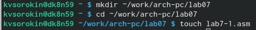{#fig:001 width=70%}

Откроем файл lab7-1.asm и введём в него текст программы(рис. @fig:002).

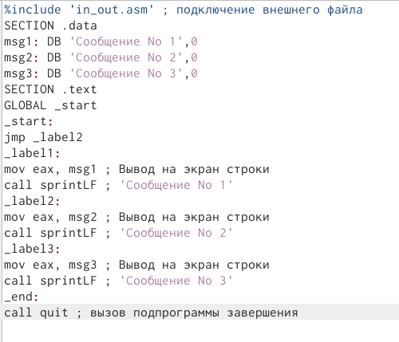{#fig:002 width=70%}

После компиляции файлов запустим программу и увидим следующих раезультат(рис. @fig:003).

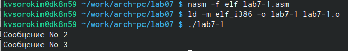{#fig:003 width=70%}

Изменим текст программы так, чтобы она выводила сначала Сообщение 2, потом Сообщение 1(рис. @fig:004).

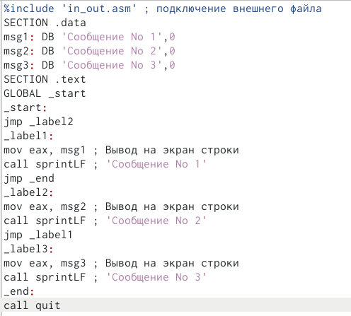{#fig:004 width=70%}

Удостоверимся, в верности выполнения программы(рис. @fig:005).

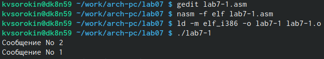{#fig:005 width=70%}

Теперь ещё раз изменим программу, чтобы она выводила сообщения в последовательности 3, 2, 1. Для этого в конце каждого блока напишем переход на нужный блок(рис. @fig:006).

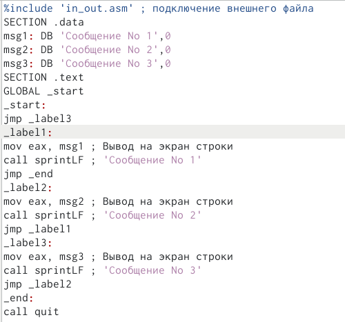{#fig:006 width=70%}

Удостоверимся, в верности выполнения программы(рис. @fig:007).

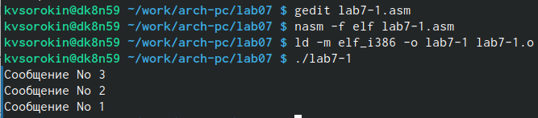{#fig:007 width=70%}

Создадим файл lab7-2.asm и впишем в него текст нахождения наибольшего числа из двух данных и одного введённого. (рис. @fig:008).

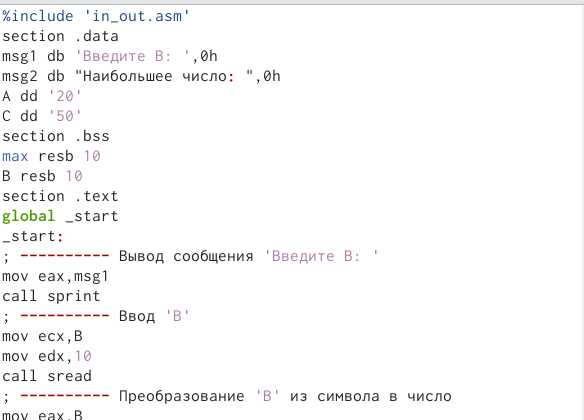{#fig:008 width=70%}

Проверим работу программы для разных значений B.(рис. @fig:009).

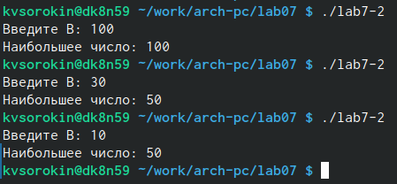{#fig:009 width=70%}

Командой 'nasm -f elf -l lab7-2.lst lab7-2.asm', создадим файл листинга и изучим его содержимое. Выберем 3 случайные строчки. На них мы осуществляется ввод значения для переменной B. НА строке 17 мы записываем адрес переменной в eax. На строке 18 передаём описатель 10 в edx. А на 19-ой строке мы с использованием полученных данных осуществляем ввод данных в ecx, который в данной ситуации отсылается к B.(рис. @fig:010).

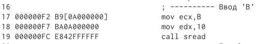{#fig:010 width=70%}

Удалим один операнд у инструкции с двумя операндами. После попытки выполнениея программы увидим ошибку. Заново создав файл листинга на месте удаления операнда увидим ту самую ошибку. (рис. @fig:011).

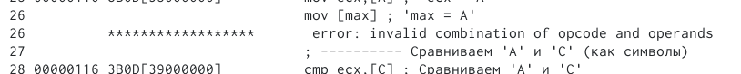{#fig:011 width=70%}

## Самостоятельная работа

Так как в предыдущей самостоятельной работе у нас был вариант 1, то, пользуясь полученными заниями, напишем программу, которая будет сравнивать три числа: 17, 23, 45. (рис. @fig:012).

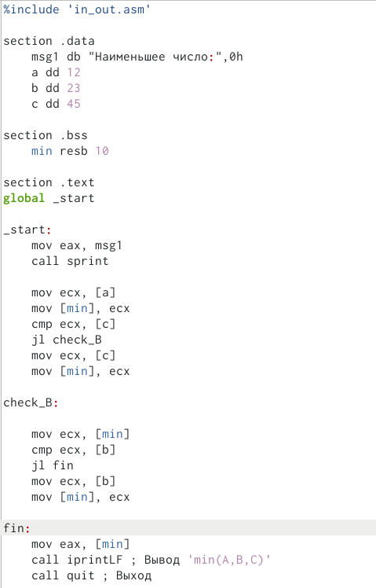{#fig:012 width=70%}

Скомпилируем программу и после запуска убедимся, что выводится именно наименьшее число - 17. (рис. @fig:013).

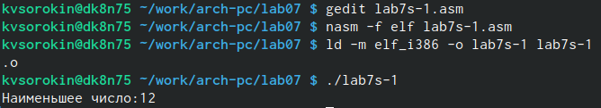{#fig:013 width=70%}

Напишем вторую программу, которая принимает два значения, и в случае если значения числа А больше числа Х, то выводит результат такого выражения: 2а-х,иначе выводит число 8. (к сожалению, из-за размера программы она полностью на поместилась на скиншот) (рис. @fig:014).

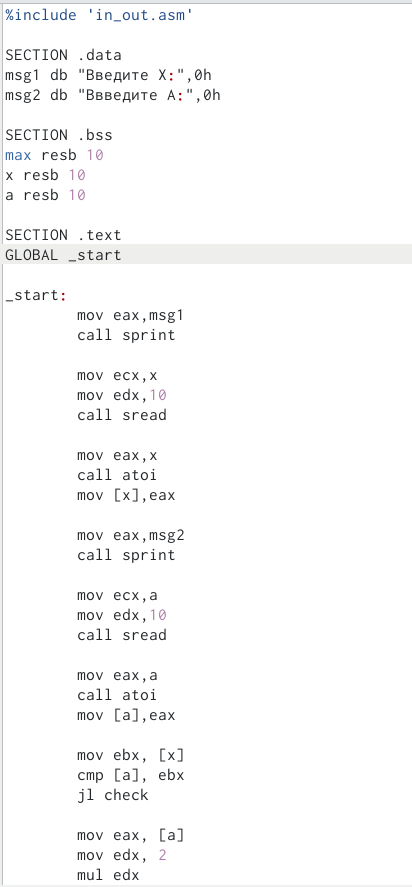{#fig:014 width=70%}\

Выполним программу с использованием данных в варинте значений ((1,2) и (2,1)), и будимся, что они верное удовлетворяют условиям выражения. (рис. @fig:015).

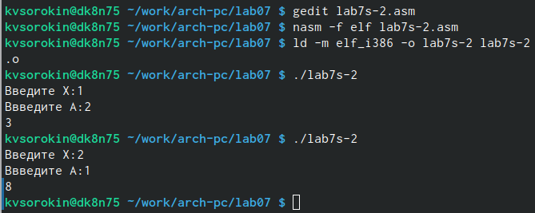{#fig:015 width=70%}

# Выводы

Мы научились писать программы на языке ассемблера с использованием различных переходов.

# Список литературы{.unnumbered}

1. GDB: The GNU Project Debugger. — URL: https://www.gnu.org/software/gdb/.
2. GNU Bash Manual. — 2016. — URL: https://www.gnu.org/software/bash/manual/.
3. Midnight Commander Development Center. — 2021. — URL: https://midnightcommander.org/.
4. NASM Assembly Language Tutorials. — 2021. — URL: https://asmtutor.com/.
5. Newham C. Learning the bash Shell: Unix Shell Programming. — O’Reilly Media, 2005. — 354 с. — (In a Nutshell). — ISBN 0596009658. — URL: http://www.amazon.com Learning-bash-Shell-Programming-Nutshell/dp/0596009658.
6. Robbins A. Bash Pocket Reference. — O’Reilly Media, 2016. — 156 с. — ISBN 978-1491941591.
7. The NASM documentation. — 2021. — URL: https://www.nasm.us/docs.php.
8. Zarrelli G. Mastering Bash. — Packt Publishing, 2017. — 502 с. — ISBN 9781784396879.
9. Колдаев В. Д., Лупин С. А. Архитектура ЭВМ. — М. : Форум, 2018.
10. Куляс О. Л., Никитин К. А. Курс программирования на ASSEMBLER. — М. :Солон-Пресс, 2017.
11. Новожилов О. П. Архитектура ЭВМ и систем. — М. : Юрайт, 2016.
12. Расширенный ассемблер: NASM. — 2021. — URL: https://www.opennet.ru/docs/RUS/nasm/.
13. Робачевский А., Немнюгин С., Стесик О. Операционная система UNIX. — 2-е изд. — БХВ- Петербург, 2010. — 656 с. — ISBN 978-5-94157-538-1.
14. Столяров А. Программирование на языке ассемблера NASM для ОС Unix. — 2-е изд. — М. : МАКС Пресс, 2011. — URL: http://www.stolyarov.info/books/asm_unix.
15. Таненбаум Э. Архитектура компьютера. — 6-е изд. — СПб. : Питер, 2013. - 874 с. — (Классика Computer Science).
16. Таненбаум Э., Бос Х. Современные операционные системы. — 4-е изд. -СПб. : Питер,
2015. — 1120 с. — (Классика Computer Science)
