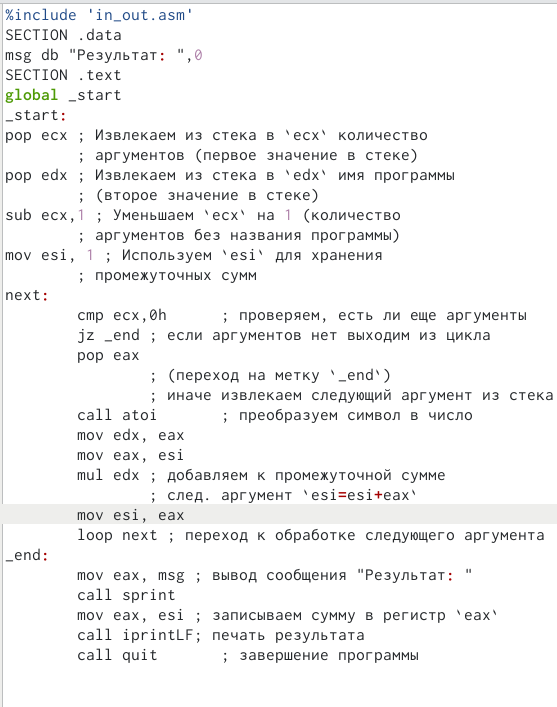

---
## Front matter
title: "Лабораторная работа номер 8."
subtitle: "Программирование цикла. Обработка аргументов командной строки."
author: "Сорокин Кирилл"

## Generic otions
lang: ru-RU
toc-title: "Содержание"

## Bibliography
bibliography: bib/cite.bib
csl: pandoc/csl/gost-r-7-0-5-2008-numeric.csl

## Pdf output format
toc: true # Table of contents
toc-depth: 2
lof: true # List of figures
fontsize: 12pt
linestretch: 1.5
papersize: a4
documentclass: scrreprt
## I18n polyglossia
polyglossia-lang:
  name: russian
  options:
	- spelling=modern
	- babelshorthands=true
polyglossia-otherlangs:
  name: english
## I18n babel
babel-lang: russian
babel-otherlangs: english
## Fonts
mainfont: PT Serif
romanfont: PT Serif
sansfont: PT Sans
monofont: PT Mono
mainfontoptions: Ligatures=TeX
romanfontoptions: Ligatures=TeX
sansfontoptions: Ligatures=TeX,Scale=MatchLowercase
monofontoptions: Scale=MatchLowercase,Scale=0.9
## Biblatex
biblatex: true
biblio-style: "gost-numeric"
biblatexoptions:
  - parentracker=true
  - backend=biber
  - hyperref=auto
  - language=auto
  - autolang=other*
  - citestyle=gost-numeric
## Pandoc-crossref LaTeX customization
figureTitle: "Рис."
listingTitle: "Листинг"
lofTitle: "Список иллюстраций"
lotTitle: "Список таблиц"
lolTitle: "Листинги"
## Misc options
indent: true
header-includes:
  - \usepackage{indentfirst}
  - \usepackage{float} # keep figures where there are in the text
  - \floatplacement{figure}{H} # keep figures where there are in the text
---

# Цель работы

Научиться писать циклы и обрабатывать информацию из командной строки с помощью языка ассемблер.

# Задание

Изучить приведённый материал на практике и выполнить самостоятельную работу.

# Теоретическое введение

Стек — это структура данных, организованная по принципу LIFO («Last In — First Out» или «последним пришёл — первым ушёл»). Стек является частью архитектуры процессора и реализован на аппаратном уровне. Для работы со стеком в процессоре есть специальные регистры (ss, bp, sp) и команды. 
Основной функцией стека является функция сохранения адресов возврата и передачи аргументов при вызове процедур. Кроме того, в нём выделяется память для локальных переменных и могут временно храниться значения регистров.
Стек имеет вершину, адрес последнего добавленного элемента, который хранится в регистре esp (указатель стека). Противоположный конец стека называется дном. Значение, помещённое в стек последним, извлекается первым. При помещении значения в стек указатель стека уменьшается, а при извлечении — увеличивается.

# Выполнение лабораторной работы

Создадим необходимые для работы директории и файлы (рис. @fig:001).

{#fig:001 width=70%}

Откроем файл lab8-1.asm и введём в него текст программы(рис. @fig:002).

{#fig:002 width=70%}

После компиляции файлов запустим программу и увидим не совсем требуемый результат число хоть и уменьшается, но не до нуля(рис. @fig:003).

{#fig:003 width=70%}

Изменим содержимое label в тексте программы(рис. @fig:004).

{#fig:004 width=70%}

Попробуем ещё раз выполнить программу и увидим, что программа попадает в бесконечный цикл, выводя совсем не корректные значения. Это связанно с тем, что мы вначале уменьшает ecx с помощью sub, а потом ещё раз с помощью loop, поэтому он и не принимает значения 0 и уходит в бесконечность.(рис. @fig:005).

{#fig:005 width=70%}

Ещё раз изменим содержимое label так, чтобы ecx мог заходить и выходить из стека.(рис. @fig:006).

{#fig:006 width=70%}

После выполнения опять увидим, что наконец достигнут желаемый результат.(рис. @fig:007).

{#fig:007 width=70%}

Создадим файл lab8-2.asm и введём в него текст программы(рис. @fig:008).

{#fig:008 width=70%}

Выполним и увидим, что программа считает за аргументы каждый данный ей элемент разделённый пробелом. (их 4) (рис. @fig:009).

{#fig:009 width=70%}

Создадим файл lab8-3.asm и запишем в него программу для суммы введённых чисел (рис. @fig:010).

{#fig:010 width=70%}

Проверим её на нескольких наборах данных. (рис. @fig:011).

{#fig:011 width=70%}

Изменим текст программы, чтобы она умножала числа(рис. @fig:012).

{#fig:012 width=70%}

Здесь видны основные отличия от предыдущей версии программы. Однако необходимо также изменить начально значение esi на 1, чтобы умножение выполнялось корректно. (рис. @fig:013).

{#fig:013 width=70%}

Убедимся в корректности умножения чисел (рис. @fig:014).

{#fig:014 width=70%}\

## Самостоятельная работа

Так как наш вариант 1, напишем программу для суммы значений функции f(x)=2x+15 от введённых значений (рис. @fig:015).

{#fig:015 width=70%}

Основными изменениями от программы складывающей аргументы будет в необходимости домножать аргумент на 2 и прибавлять к нему 15. Однако необходимо также не забыть о том, что нужно ещё вывести функцию на экран (3 строки разбросаны по тексту программы, поэтому они не отображены на этом рисунке) (рис. @fig:016).

{#fig:016 width=70%}

Скомпилировав файл, убедимся, что он работает корректно (рис. @fig:017).

{#fig:017 width=70%}

# Выводы

Мы научились использовать писать циклы на языке ассемблера, а также получать информацию из командной строки.

# Список литературы{.unnumbered}

1. GDB: The GNU Project Debugger. — URL: https://www.gnu.org/software/gdb/.
2. GNU Bash Manual. — 2016. — URL: https://www.gnu.org/software/bash/manual/.
3. Midnight Commander Development Center. — 2021. — URL: https://midnightcommander.org/.
4. NASM Assembly Language Tutorials. — 2021. — URL: https://asmtutor.com/.
5. Newham C. Learning the bash Shell: Unix Shell Programming. — O’Reilly Media, 2005. — 354 с. — (In a Nutshell). — ISBN 0596009658. — URL: http://www.amazon.com Learning-bash-Shell-Programming-Nutshell/dp/0596009658.
6. Robbins A. Bash Pocket Reference. — O’Reilly Media, 2016. — 156 с. — ISBN 978-1491941591.
7. The NASM documentation. — 2021. — URL: https://www.nasm.us/docs.php.
8. Zarrelli G. Mastering Bash. — Packt Publishing, 2017. — 502 с. — ISBN 9781784396879.
9. Колдаев В. Д., Лупин С. А. Архитектура ЭВМ. — М. : Форум, 2018.
10. Куляс О. Л., Никитин К. А. Курс программирования на ASSEMBLER. — М. :Солон-Пресс, 2017.
11. Новожилов О. П. Архитектура ЭВМ и систем. — М. : Юрайт, 2016.
12. Расширенный ассемблер: NASM. — 2021. — URL: https://www.opennet.ru/docs/RUS/nasm/.
13. Робачевский А., Немнюгин С., Стесик О. Операционная система UNIX. — 2-е изд. — БХВ- Петербург, 2010. — 656 с. — ISBN 978-5-94157-538-1.
14. Столяров А. Программирование на языке ассемблера NASM для ОС Unix. — 2-е изд. — М. : МАКС Пресс, 2011. — URL: http://www.stolyarov.info/books/asm_unix.
15. Таненбаум Э. Архитектура компьютера. — 6-е изд. — СПб. : Питер, 2013. - 874 с. — (Классика Computer Science).
16. Таненбаум Э., Бос Х. Современные операционные системы. — 4-е изд. -СПб. : Питер,
2015. — 1120 с. — (Классика Computer Science)
