---
## Front matter
title: "Лабораторная работа номер 9."
subtitle: "Понятие подпрограммы. Отладчик GDB."
author: "Сорокин Кирилл"

## Generic otions
lang: ru-RU
toc-title: "Содержание"

## Bibliography
bibliography: bib/cite.bib
csl: pandoc/csl/gost-r-7-0-5-2008-numeric.csl

## Pdf output format
toc: true # Table of contents
toc-depth: 2
lof: true # List of figures
fontsize: 12pt
linestretch: 1.5
papersize: a4
documentclass: scrreprt
## I18n polyglossia
polyglossia-lang:
  name: russian
  options:
	- spelling=modern
	- babelshorthands=true
polyglossia-otherlangs:
  name: english
## I18n babel
babel-lang: russian
babel-otherlangs: english
## Fonts
mainfont: PT Serif
romanfont: PT Serif
sansfont: PT Sans
monofont: PT Mono
mainfontoptions: Ligatures=TeX
romanfontoptions: Ligatures=TeX
sansfontoptions: Ligatures=TeX,Scale=MatchLowercase
monofontoptions: Scale=MatchLowercase,Scale=0.9
## Biblatex
biblatex: true
biblio-style: "gost-numeric"
biblatexoptions:
  - parentracker=true
  - backend=biber
  - hyperref=auto
  - language=auto
  - autolang=other*
  - citestyle=gost-numeric
## Pandoc-crossref LaTeX customization
figureTitle: "Рис."
listingTitle: "Листинг"
lofTitle: "Список иллюстраций"
lotTitle: "Список таблиц"
lolTitle: "Листинги"
## Misc options
indent: true
header-includes:
  - \usepackage{indentfirst}
  - \usepackage{float} # keep figures where there are in the text
  - \floatplacement{figure}{H} # keep figures where there are in the text
---

# Цель работы

Научиться писать подпрограммы и работать с отладчиком GDB.

# Задание

Используя написать подпрограммы внутри программ, а также проверять работу программ с помощью отладчика.

# Теоретическое введение

Отладка — это процесс поиска и исправления ошибок в программе. 
GDB (GNU Debugger — отладчик проекта GNU) [1] работает на многих UNIX-подобных
системах и умеет производить отладку многих языков программирования. GDB предлагает
обширные средства для слежения и контроля за выполнением компьютерных программ. Отладчик не содержит собственного графического пользовательского интерфейса и использует стандартный текстовый интерфейс консоли. Однако для GDB существует несколько сторонних графических надстроек, а кроме того, некоторые интегрированные среды разработки используют его в качестве базовой подсистемы отладки.

# Выполнение лабораторной работы

Создадим директории и файл для работы (рис. @fig:001).

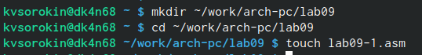{#fig:001 width=70%}

Запишем листинг 9.1 в файл(рис. @fig:002).

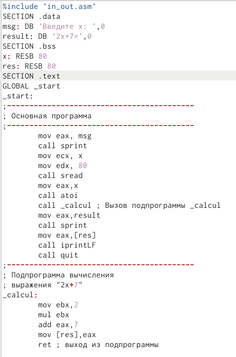{#fig:002 width=70%}

Проверим работу файла(рис. @fig:003).

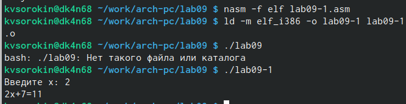{#fig:003 width=70%}

Изменим код программы для вложенных функций (рис. @fig:004).

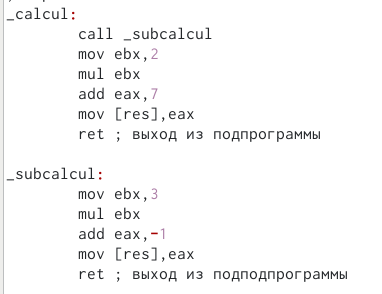{#fig:004 width=70%}

Проверим работу (рис. @fig:005).

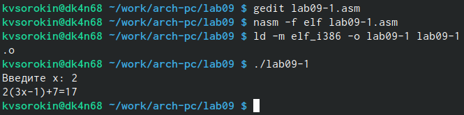{#fig:005 width=70%}

Введём листинг второй программы в новый файл (рис. @fig:006).

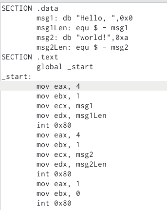{#fig:006 width=70%}

Скомпилируем файлы и запустим в оболочке GDB командой gdb lab09-2(рис. @fig:007).

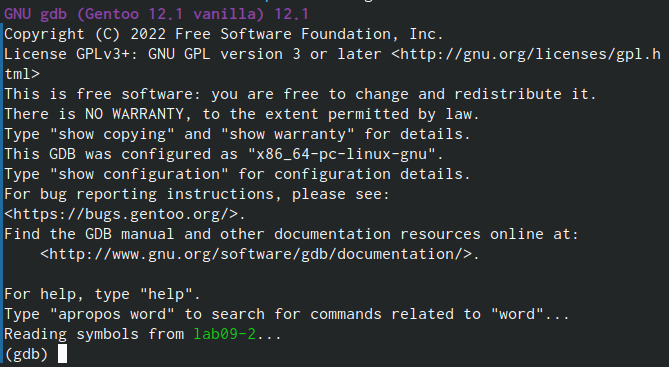{#fig:007 width=70%}

Запустим программу командой run (рис. @fig:008).

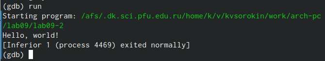{#fig:008 width=70%}

Поставим брейкпоинт и запустим программу снова (рис. @fig:009).

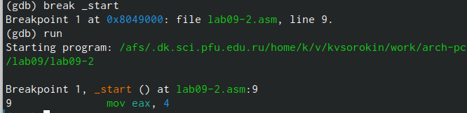{#fig:009 width=70%}

Посмотрим дисассимилированный код программы с помощью команды disassemble
начиная с метки _start (рис. @fig:010).

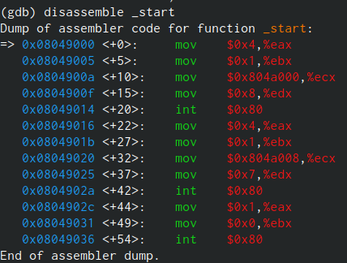{#fig:010 width=70%}

Переключим на отображение команд с Intel’овским синтаксисом, введя команду set
disassembly-flavor intel (рис. @fig:011).

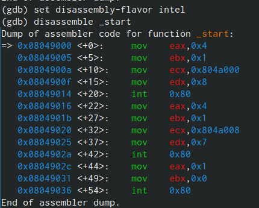{#fig:011 width=70%}

Командой layout asm, откроем окно с дисассимилированием программы (рис. @fig:012).

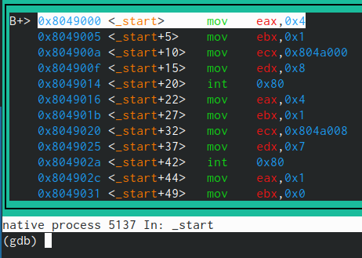{#fig:012 width=70%}

Командой layout regs, откроем окно с названия регистров и их текущие значения(рис. @fig:013).

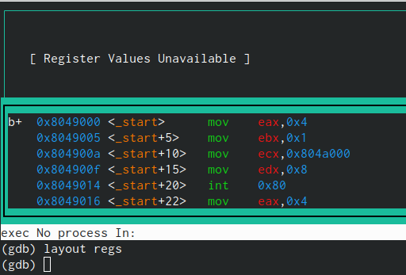{#fig:013 width=70%}

Командой break установим ещё один брейкпоинт (рис. @fig:014).

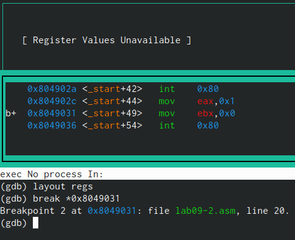{#fig:014 width=70%}

Командой i b посморим позиции брейкпоинтов(рис. @fig:015).

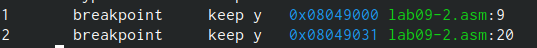{#fig:015 width=70%}

Командой info registers, увидим информацию о регистах(рис. @fig:016).

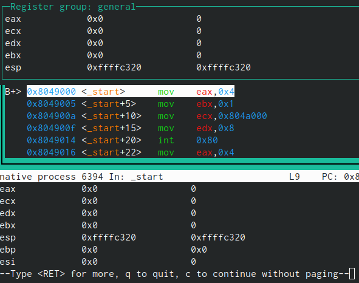{#fig:016 width=70%}

Посмотрим значение переменной msg1 по имени (рис. @fig:017).

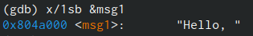{#fig:017 width=70%}

Изменим значение первой буквы на маленькую версию(рис. @fig:018).

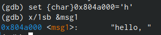{#fig:018 width=70%}

Аналогично сделаем с msg2 (рис. @fig:019).

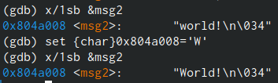{#fig:019 width=70%}

Выведим в различных форматах значение регистра edx (рис. @fig:020).

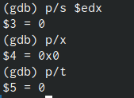{#fig:020 width=70%}

Заменим значение ebx на '2', а затем на 2. Заметим, что выодится разное значене из-за разных форматов данных (рис. @fig:021).

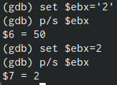{#fig:021 width=70%}

Довыполним программу командой с, затем выйдем из gdb командой quit(рис. @fig:022).

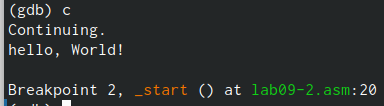{#fig:022 width=70%}

Скопируем файл lab8-2.asm с программой выводящей на экран аргументы командной строки в файл с именем lab09-3.asm и скомпилируем файлы (рис. @fig:023).

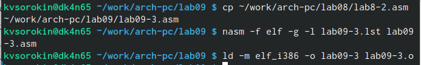{#fig:023 width=70%}

Запустим gdb передав аргументы вместе с файлом, постави брейкпоинт и увидим количество аргументов командной строки (рис. @fig:024).

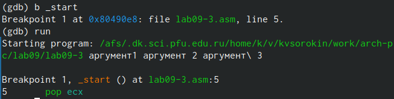{#fig:024 width=70%}

Посморим все позиции стека по адресу. Заметим, что все аргументы расположенны на растоянии в 4 байта друг от друга (рис. @fig:025).

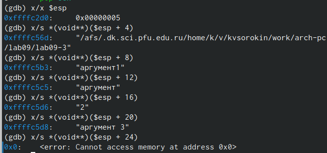{#fig:025 width=70%}

## Самостоятельная работа

Изменим текст самостоятельной работы из 8 лабораторной так, чтобы в ней задействовалась подпрограмма(рис. @fig:026).

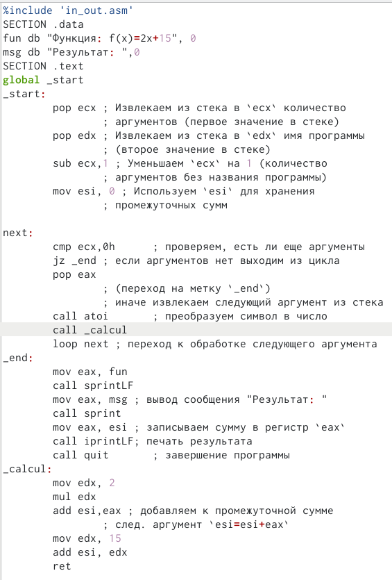{#fig:026 width=70%}

Проверим, что она всё ещё работает корректно (рис. @fig:027).

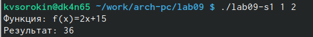{#fig:027 width=70%}

Введём листинг 9.3 во второй файл самостоятельной работы (рис. @fig:028).

{#fig:028 width=70%}

Проверим работу и увидим, что результат не корректен (рис. @fig:029).

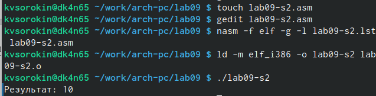{#fig:029 width=70%}

Запустим программу в отладчике и поставим брейкпоинт в месте, до того как прибавили 5 (рис. @fig:030).

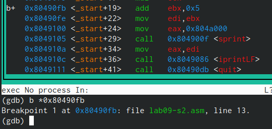{#fig:030 width=70%}

Увидим, что значение ebx не равно 20, значит проблема в умножении(рис. @fig:031).

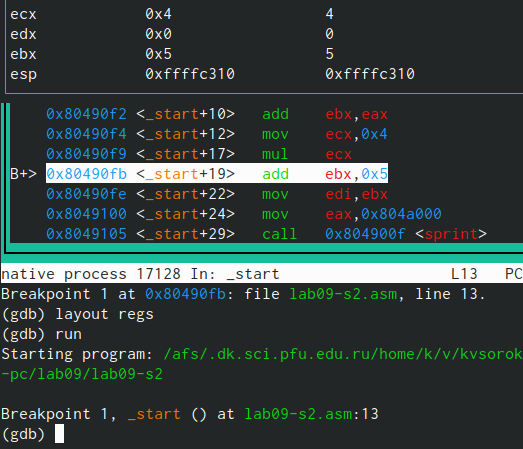{#fig:031 width=70%}

Исправим ошибку(рис. @fig:032).

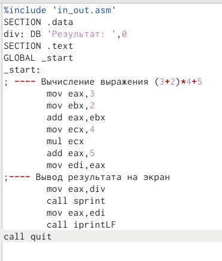{#fig:032 width=70%}

Удостоверимся, что теперь программа работает корректно (рис. @fig:033).

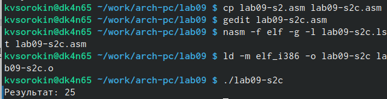{#fig:033 width=70%}

# Выводы

Мы научились GDB, а также писать подпрограммы

# Список литературы{.unnumbered}

1. GDB: The GNU Project Debugger. — URL: https://www.gnu.org/software/gdb/.
2. GNU Bash Manual. — 2016. — URL: https://www.gnu.org/software/bash/manual/.
3. Midnight Commander Development Center. — 2021. — URL: https://midnightcommander.org/.
4. NASM Assembly Language Tutorials. — 2021. — URL: https://asmtutor.com/.
5. Newham C. Learning the bash Shell: Unix Shell Programming. — O’Reilly Media, 2005. — 354 с. — (In a Nutshell). — ISBN 0596009658. — URL: http://www.amazon.com Learning-bash-Shell-Programming-Nutshell/dp/0596009658.
6. Robbins A. Bash Pocket Reference. — O’Reilly Media, 2016. — 156 с. — ISBN 978-1491941591.
7. The NASM documentation. — 2021. — URL: https://www.nasm.us/docs.php.
8. Zarrelli G. Mastering Bash. — Packt Publishing, 2017. — 502 с. — ISBN 9781784396879.
9. Колдаев В. Д., Лупин С. А. Архитектура ЭВМ. — М. : Форум, 2018.
10. Куляс О. Л., Никитин К. А. Курс программирования на ASSEMBLER. — М. :Солон-Пресс, 2017.
11. Новожилов О. П. Архитектура ЭВМ и систем. — М. : Юрайт, 2016.
12. Расширенный ассемблер: NASM. — 2021. — URL: https://www.opennet.ru/docs/RUS/nasm/.
13. Робачевский А., Немнюгин С., Стесик О. Операционная система UNIX. — 2-е изд. — БХВ- Петербург, 2010. — 656 с. — ISBN 978-5-94157-538-1.
14. Столяров А. Программирование на языке ассемблера NASM для ОС Unix. — 2-е изд. — М. : МАКС Пресс, 2011. — URL: http://www.stolyarov.info/books/asm_unix.
15. Таненбаум Э. Архитектура компьютера. — 6-е изд. — СПб. : Питер, 2013. - 874 с. — (Классика Computer Science).
16. Таненбаум Э., Бос Х. Современные операционные системы. — 4-е изд. -СПб. : Питер,
2015. — 1120 с. — (Классика Computer Science)
