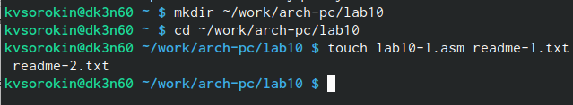
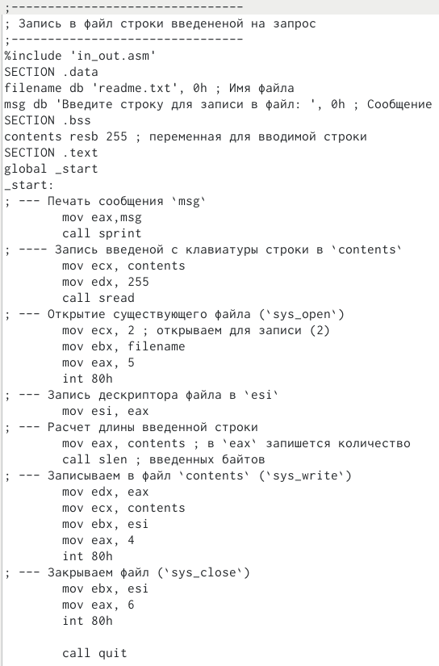
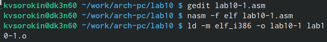
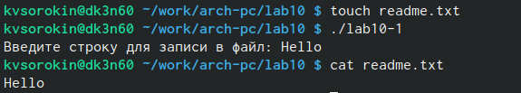
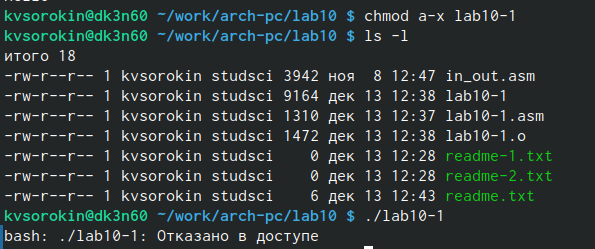
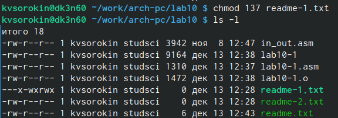
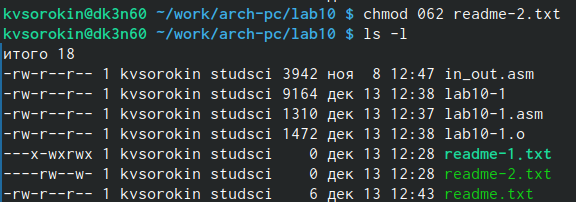
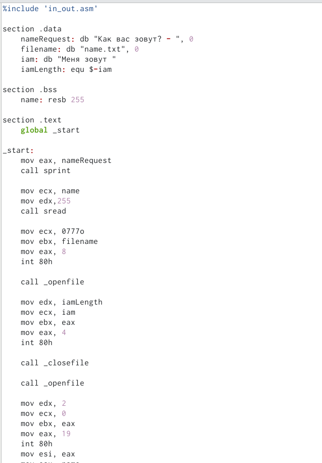
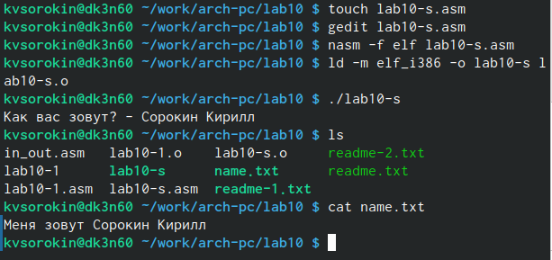

---
## Front matter
title: "Лабораторная работа номер 10."
subtitle: "Работа с файлами средствами Nasm"
author: "Сорокин Кирилл"

## Generic otions
lang: ru-RU
toc-title: "Содержание"

## Bibliography
bibliography: bib/cite.bib
csl: pandoc/csl/gost-r-7-0-5-2008-numeric.csl

## Pdf output format
toc: true # Table of contents
toc-depth: 2
lof: true # List of figures
fontsize: 12pt
linestretch: 1.5
papersize: a4
documentclass: scrreprt
## I18n polyglossia
polyglossia-lang:
  name: russian
  options:
	- spelling=modern
	- babelshorthands=true
polyglossia-otherlangs:
  name: english
## I18n babel
babel-lang: russian
babel-otherlangs: english
## Fonts
mainfont: PT Serif
romanfont: PT Serif
sansfont: PT Sans
monofont: PT Mono
mainfontoptions: Ligatures=TeX
romanfontoptions: Ligatures=TeX
sansfontoptions: Ligatures=TeX,Scale=MatchLowercase
monofontoptions: Scale=MatchLowercase,Scale=0.9
## Biblatex
biblatex: true
biblio-style: "gost-numeric"
biblatexoptions:
  - parentracker=true
  - backend=biber
  - hyperref=auto
  - language=auto
  - autolang=other*
  - citestyle=gost-numeric
## Pandoc-crossref LaTeX customization
figureTitle: "Рис."
listingTitle: "Листинг"
lofTitle: "Список иллюстраций"
lotTitle: "Список таблиц"
lolTitle: "Листинги"
## Misc options
indent: true
header-includes:
  - \usepackage{indentfirst}
  - \usepackage{float} # keep figures where there are in the text
  - \floatplacement{figure}{H} # keep figures where there are in the text
---

# Цель работы

Научиться писать программы на языке ассемблера для работы с файлами.

# Задание

Изучить приведённый материал на практике и выполнить самостоятельную работу.

# Теоретическое введение

ОС GNU/Linux является многопользовательской операционной системой. И для обеспечения защиты данных одного пользователя от действий других пользователей существуют специальные механизмы разграничения доступа к файлам. Кроме ограничения доступа, дан-ный механизм позволяет разрешить другим пользователям доступ данным для совместной работы. Права доступа определяют набор действий (чтение, запись, выполнение), разрешённых для выполнения пользователям системы над файлами. Для каждого файла пользователь может входить в одну из трех групп: владелец, член группы владельца, все остальные. Для каждой из этих групп может быть установлен свой набор прав доступа. Владельцем файла является его создатель.

# Выполнение лабораторной работы

Создадим необходимые для работы директории и файлы (рис. @fig:001).

{#fig:001 width=70%}

Откроем файл lab10-1.asm и введём в него текст листинга 10.1(рис. @fig:002).

{#fig:002 width=70%}

Скомпелируем программу(рис. @fig:003).

{#fig:003 width=70%}

Проверим работу программы(рис. @fig:004).

{#fig:004 width=70%}

Изменим права доступа для программы и увидим, что теперь ей отказано в доступе. Это потому, что заданной командой мы отключаем право доступа.(рис. @fig:005).

{#fig:005 width=70%}

В соответствии с нашим вариантом зададим необходимы права доступа для файлов.(рис. @fig:006).

{#fig:006 width=70%}

Изменим права доступа для readme-1.txt на --x -wx rwx, и достоверимся, что всё верно(рис. @fig:007).

{#fig:007 width=70%}

Изменим права доступа для readme-2.txt на 000 110 010, и по таблице достоверимся, что всё верно (рис. @fig:008).

{#fig:008 width=70%}

## Самостоятельная работа

Основываясь на значния курса и урока, напишем программу для записи имени в созданный файл. (к сожалению снимок экрана не отображает весь линстинг)(рис. @fig:009).

{#fig:009 width=70%}

Проверим работу программы и удостоверимся, что создан необходимый файл и в него записанно 'Меня зовут Сорокин Кирилл'

{#fig:010 width=70%}

# Выводы

Мы научились писать программы на языке ассемблера, которые взаимодействуют с файлами.

# Список литературы{.unnumbered}

1. GDB: The GNU Project Debugger. — URL: https://www.gnu.org/software/gdb/.
2. GNU Bash Manual. — 2016. — URL: https://www.gnu.org/software/bash/manual/.
3. Midnight Commander Development Center. — 2021. — URL: https://midnightcommander.org/.
4. NASM Assembly Language Tutorials. — 2021. — URL: https://asmtutor.com/.
5. Newham C. Learning the bash Shell: Unix Shell Programming. — O’Reilly Media, 2005. — 354 с. — (In a Nutshell). — ISBN 0596009658. — URL: http://www.amazon.com Learning-bash-Shell-Programming-Nutshell/dp/0596009658.
6. Robbins A. Bash Pocket Reference. — O’Reilly Media, 2016. — 156 с. — ISBN 978-1491941591.
7. The NASM documentation. — 2021. — URL: https://www.nasm.us/docs.php.
8. Zarrelli G. Mastering Bash. — Packt Publishing, 2017. — 502 с. — ISBN 9781784396879.
9. Колдаев В. Д., Лупин С. А. Архитектура ЭВМ. — М. : Форум, 2018.
10. Куляс О. Л., Никитин К. А. Курс программирования на ASSEMBLER. — М. :Солон-Пресс, 2017.
11. Новожилов О. П. Архитектура ЭВМ и систем. — М. : Юрайт, 2016.
12. Расширенный ассемблер: NASM. — 2021. — URL: https://www.opennet.ru/docs/RUS/nasm/.
13. Робачевский А., Немнюгин С., Стесик О. Операционная система UNIX. — 2-е изд. — БХВ- Петербург, 2010. — 656 с. — ISBN 978-5-94157-538-1.
14. Столяров А. Программирование на языке ассемблера NASM для ОС Unix. — 2-е изд. — М. : МАКС Пресс, 2011. — URL: http://www.stolyarov.info/books/asm_unix.
15. Таненбаум Э. Архитектура компьютера. — 6-е изд. — СПб. : Питер, 2013. - 874 с. — (Классика Computer Science).
16. Таненбаум Э., Бос Х. Современные операционные системы. — 4-е изд. -СПб. : Питер,
2015. — 1120 с. — (Классика Computer Science)
